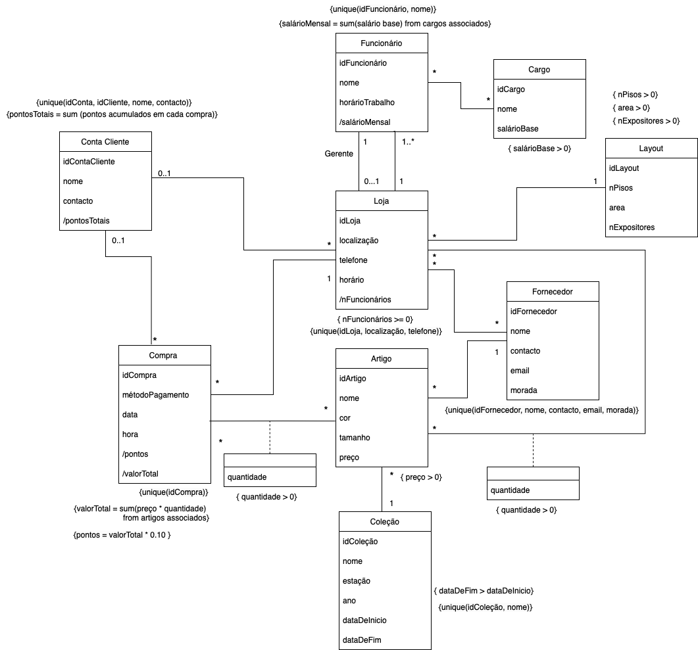

# Faculty of Engineering, University of Porto  
## Database Project: Clothing Store Franchise  

---

### **Authors**
- **Ana Luís Carvalho** - `up202307709`
- **Maria Beatriz Martins** - `up202208536`
- **Mariana Almeida** - `up202405731` 

---

## 📝 **Project Description**

This project was developed as part of the Database course. The main goal is to create and implement a database to manage the operations of a clothing store franchise. This system covers various aspects of store logistics and management, including employees, customers, purchases, and stock.

---

## 📚 **Table of Contents**

1. [Project Description](#project-description)
2. [Main Features](#main-features)
3. [UML](#uml)
4. [Relational Schema](#relational-schema)
5. [Normal Forms Analysis](#normal-forms-analysis)

---

## 🔑 **Main Features**

1. **Store Management:** Registration and consultation of stores, their layouts, and employees.
2. **Purchase Registration:** Detailed history of purchases made.
3. **Customer Management:** Optional customer registration and point accumulation.
4. **Item and Collection Control:** Identification of items by collection, season, and year.
5. **Stock Replenishment:** Integration with suppliers to keep stock updated.

---

## 📝 **UML**

This diagram illustrates the UML for the clothing store database.

---

## 📊 **Relational Schema**

### Entities and Relationships

#### Main Entities
- **AccountCustomer**: `(idAccountCustomer PK, name, contact, totalPoints)`
- **Store**: `(idStore PK, location, phone, hours, numEmployees, idLayout FK -> Layout)`
- **Layout**: `(idLayout PK, numFloors, area, numDisplays)`
- **Supplier**: `(idSupplier PK, name, contact, email, address)`
- **Purchase**: `(idPurchase PK, paymentMethod, date, time, points, totalValue, idStore FK -> Store)`
- **Employee**: `(idEmployee PK, name, workSchedule, monthlySalary, idStore FK -> Store)`
- **Position**: `(idPosition PK, name, baseSalary)`
- **Item**: `(idItem PK, name, color, size, price, idSupplier FK -> Supplier, idCollection FK -> Collection)`
- **Collection**: `(idCollection PK, name, season, year, startDate, endDate)`

#### Associative Relationships
- **BelongsTo**: `(idAccountCustomer FK -> AccountCustomer, idStore FK -> Store)`
- **Supplies**: `(idSupplier FK -> Supplier, idStore FK -> Store)`
- **Performs**: `(idEmployee FK -> Employee, idPosition FK -> Position)`
- **Has**: `(idPurchase FK -> Purchase, idItem FK -> Item, quantity)`
- **InStock**: `(idItem FK -> Item, idStore FK -> Store, quantity)`
- **Manages**: `(idStore FK -> Store, idEmployee FK -> Employee)`
- **Associated**: `(idPurchase FK -> Purchase, idAccountCustomer FK -> AccountCustomer)`

---

## 🔍 **Normal Forms Analysis**

### Entities
1. **Store**  
   - Primary Key: `idStore`  
   - Dependencies: `idStore -> location, phone, hours, idLayout`  
   - **Conclusion:** Follows 3NF and BCNF.

2. **Employee**  
   - Primary Key: `idEmployee`  
   - Dependencies: `idEmployee -> name, workSchedule, monthlySalary`  
   - **Conclusion:** Follows 3NF and BCNF.

3. **Position**  
   - Primary Key: `idPosition`  
   - Dependencies: `idPosition -> name, baseSalary`  
   - **Conclusion:** Follows 3NF and BCNF.

4. **Layout**  
   - Primary Key: `idLayout`  
   - Dependencies: `idLayout -> numFloors, area, numDisplays`  
   - **Conclusion:** Follows 3NF and BCNF.

5. **AccountCustomer**  
   - Primary Key: `idAccountCustomer`  
   - Dependencies: `idAccountCustomer -> name, contact, totalPoints`  
   - **Conclusion:** Follows 3NF and BCNF.

6. **Purchase**  
   - Primary Key: `idPurchase`  
   - Dependencies: `idPurchase -> paymentMethod, date, time, points, totalValue`  
   - **Conclusion:** Follows 3NF and BCNF.

7. **Item**  
   - Primary Key: `idItem`  
   - Dependencies: `idItem -> name, color, size, price`  
   - **Conclusion:** Follows 3NF and BCNF.

8. **Quantity (between Purchase and Item)**  
   - Primary Key: `idPurchase, idItem`  
   - Dependencies: `idPurchase -> quantity, idItem`  
   - **Conclusion:** Follows 3NF and BCNF.

9. **Collection**  
   - Primary Key: `idCollection`  
   - Dependencies: `idCollection -> name, season, year, startDate, endDate`  
   - **Conclusion:** Follows 3NF and BCNF.

10. **Quantity (between Store and Item)**  
    - Primary Key: `idStore -> idItem, quantity`  
    - Dependencies: `idStore -> idItem, quantity`  
    - **Conclusion:** Follows 3NF and BCNF.

11. **Supplier**  
    - Primary Key: `idSupplier`  
    - Dependencies: `idSupplier -> name, contact, email, address`  
    - **Conclusion:** Follows 3NF and BCNF.

### Associative Relationships
1. **BelongsTo**  
   - Primary Key: `idAccountCustomer, idStore`  
   - **Conclusion:** Follows 3NF and BCNF.

2. **Supplies**  
   - Primary Key: `idSupplier, idStore`  
   - **Conclusion:** Follows 3NF and BCNF.

3. **Performs**  
   - Primary Key: `idEmployee, idPosition`  
   - **Conclusion:** Follows 3NF and BCNF.

4. **Has**  
   - Primary Key: `idPurchase, idItem`  
   - **Conclusion:** Follows 3NF and BCNF.

5. **InStock**  
   - Primary Key: `idItem, idStore`  
   - **Conclusion:** Follows 3NF and BCNF.

6. **Manages**  
   - Primary Key: `idStore, idEmployee`  
   - **Conclusion:** Follows 3NF and BCNF.

7. **Associated**  
   - Primary Key: `idPurchase, idAccountCustomer`  
   - **Conclusion:** Follows 3NF and BCNF.

